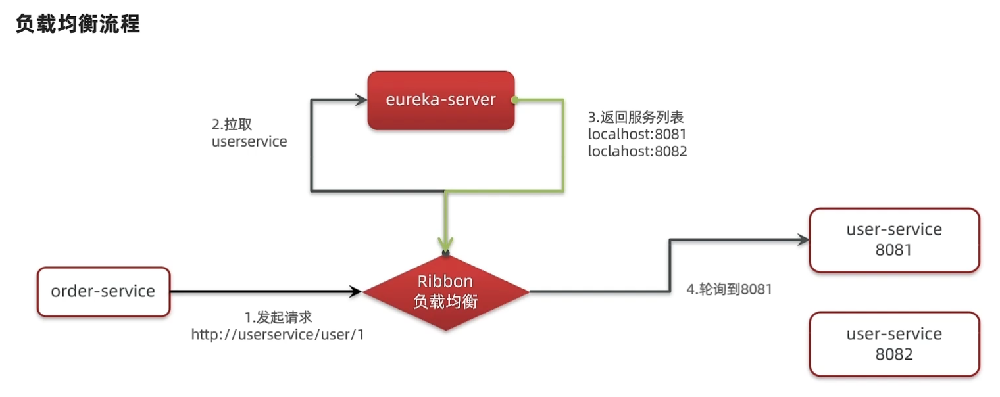
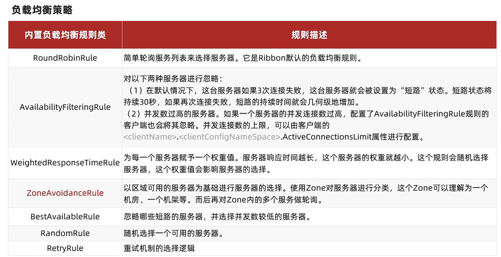

[TOC]

## 认识微服务

1. 单体架构缺点
    1. 耦合度高
2. 分布式架构优点
    1. 降低服务耦合
    2. 有利于服务升级拓展
3. 分布式架构缺点
    1. 服务拆分粒度
    2. 服务集群地址维护
    3. 服务之间如何实现远程调用
    4. 服务健康状态如何感知
4. 微服务：是一种经过良好架构设计的分布式架构方案
    1. 单一职责：微服务拆分粒度小，每一个服务都对应唯一的业务能力，做到单一职责，避免重复开发
    2. 面向服务：微服务对外暴露业务接口
    3. 自治：团队独立、技术独立、数据独立、部署独立
    4. 隔离性强：服务调用做好隔离、容错、降级，避免出现级联问题
5. 常见的微服务架构Spring Cloud、Dubbo
6. 结构
    1. 服务网关、服务集群、注册中心、配置中心
    2. 服务注册中心
       1. Eureka（弃用）
       2. Zookeeper（官网20年推荐）
       3. Consul
       4. Nacos（阿里巴巴使用，最推荐）
    3. 服务调用1
       1. Ribbon（将弃用）
       2. LoadBalancer（cloud预计将取代Ribbon）
    4. 服务调用2
       1. Feign（弃用）
       2. OpenFeign
    5. 服务降级
       1. Hystrix（弃用）
       2. resilience4j（国外）
       3. Alibaba Sentinel
    6. 服务网关
       1. Zuul（弃用）
       2. Zuul2（未产出）
       3. gateway（主流）
    7. 服务配置
       1. Config（弃用）
       2. Nacos
    8. 服务总线
       1. Bus（弃用）
       2. Nacos

## Spring Cloud

1. Spring Cloud采用英国伦敦地铁站的名称来明明，由A-Z一次类推的形式来发布迭代版本

2. 当SpringCloud的发布内容积累到临界点或者一个重大BUG被解决后，会发布一个“service releases”版本，简称SRX版本

3. 使用要注意spring Boot和Spring Cloud版本对应信息

4. 父pom.xml

   ```xml
   <?xml version="1.0" encoding="UTF-8"?>
   <project xmlns="http://maven.apache.org/POM/4.0.0"
            xmlns:xsi="http://www.w3.org/2001/XMLSchema-instance"
            xsi:schemaLocation="http://maven.apache.org/POM/4.0.0 http://maven.apache.org/xsd/maven-4.0.0.xsd">
       <modelVersion>4.0.0</modelVersion>
       <packaging>pom</packaging>
       <modules>
           <module>cloud-provider-payment8001</module>
           <module>cloud-consumer-order80</module>
           <module>cloud-api-commons</module>
       </modules>
   
   
       <groupId>org.example</groupId>
       <artifactId>learnSpringCloud</artifactId>
       <version>1.0-SNAPSHOT</version>
   
   
       <!--统一管理jar包版本-->
       <properties>
           <project.bulid.sourceEncoding>UTF-8</project.bulid.sourceEncoding>
           <maven.compiler.source>17</maven.compiler.source>
           <maven.compiler.target>17</maven.compiler.target>
           <junit.version>4.13</junit.version>
           <java.version>17</java.version>
           <spring-cloud.version>2021.0.3</spring-cloud.version>
           <spring-boot.version>2.6.8</spring-boot.version>
           <spring-cloud-alibaba.version>2021.0.1.0</spring-cloud-alibaba.version>
           <mybatis-plus-boot-starter>3.5.1</mybatis-plus-boot-starter>
           <mybatis-spring-boot-starter>2.2.2</mybatis-spring-boot-starter>
       </properties>
   
       <!--子模块继承之后提供作用：锁定版本，子模块不用谢groupId和version-->
       <dependencyManagement>
           <dependencies>
               <dependency>
                   <groupId>org.springframework.boot</groupId>
                   <artifactId>spring-boot-starter-parent</artifactId>
                   <version>${spring-boot.version}</version>
                   <type>pom</type>
                   <scope>import</scope>
               </dependency>
               <dependency>
                   <groupId>org.springframework.cloud</groupId>
                   <artifactId>spring-cloud-dependencies</artifactId>
                   <version>${spring-cloud.version}</version>
                   <type>pom</type>
                   <scope>import</scope>
               </dependency>
               <dependency>
                   <groupId>org.mybatis.spring.boot</groupId>
                   <artifactId>mybatis-spring-boot-starter</artifactId>
                   <version>${mybatis-spring-boot-starter}</version>
               </dependency>
               <dependency>
                   <groupId>com.baomidou</groupId>
                   <artifactId>mybatis-plus-boot-starter</artifactId>
                   <version>${mybatis-plus-boot-starter}</version>
               </dependency>
               <dependency>
                   <groupId>com.alibaba.cloud</groupId>
                   <artifactId>spring-cloud-alibaba-dependencies</artifactId>
                   <version>${spring-cloud-alibaba.version}</version>
                   <type>pom</type>
                   <scope>import</scope>
               </dependency>
           </dependencies>
       </dependencyManagement>
       <build>
           <plugins>
               <plugin>
                   <groupId>org.springframework.boot</groupId>
                   <artifactId>spring-boot-maven-plugin</artifactId>
                   <version>${spring-boot.version}</version>
                   <configuration>
                       <excludes>
                           <exclude>
                               <groupId>org.projectlombok</groupId>
                               <artifactId>lombok</artifactId>
                           </exclude>
                       </excludes>
                   </configuration>
               </plugin>
           </plugins>
       </build>
   </project>
   ```

   

## Devtools

1. 自动热部署

2. 依赖

   ```xml
           <dependency>
               <groupId>org.springframework.boot</groupId>
               <artifactId>spring-boot-devtools</artifactId>
               <scope>runtime</scope>
               <optional>true</optional>
           </dependency>
   ```

## RestTemplate

1. RestTemplate提供了多种便捷访问远程Http服务的方法
2. 是一种简单便捷的访问restful服务模版类，是Spring提供的用于访问Rest服务的客户端模版工具集
3. 三个参数
   1. 请求地址
   2. 请求参数
   3. 响应被转换成的对象

## Eureka服务注册与发现

1. 简介

   1. Eureka采用CS的设计架构，Eureka Server作为服务注册功能的服务器，他是服务注册中心，而系统中的其他微服务，使用Eureka的哭护短联机得到Eureka Server并维持心跳连接。这样就可以通过Eureka Server来监控系统中各个微服务是否正常运行

   2. 在服务注册与发现中，有一个注册中心。当服务启动的时候，会把当前自己服务器的信息，比如服务地址等以别名方式注册到注册中心上。另一方，以该别名的方式去注册中心上获取到实际的服务通讯地址，然后在实现本地RPC调用。RPC远程调用框架核心设计思想在于注册中心，因为使用注册中心管理每个服务于误服之间的一个依赖关系（服务治理概念）。在任何RPC远程框架中，都会有一个注册中心（存放误服地址相关信息（接口地址））

2. 依赖

   ```xml
           <dependency>
               <groupId>org.springframework.cloud</groupId>
               <artifactId>spring-cloud-starter-netflix-eureka-client</artifactId>
           </dependency>
           <dependency>
               <groupId>org.springframework.cloud</groupId>
               <artifactId>spring-cloud-starter-netflix-eureka-server</artifactId>
           </dependency>
   ```

3. 单机版配置

   1. 服务端配置

      1. 启动类@EnableEurekaServer 添加注解

      2. yml配置文件


```yml
  server:
    port: 10086
  eureka:
    instance:
      hostname: localhost
    client:
      # 表示不注册自己
      register-with-eureka: false
      # 表示自己就是注册中心，不需要检索
      fetch-registry: false
      service-url:
        defaultZone: http://${eureka.instance.hostname}:${server.port}/eureka/
  #      defaultZone: http://127.0.0.1:7001/eureka/
  spring:
    application:
      name: eurka-server
```

   2. 客户端配置

      1. 启动类@EnableEurekaClient注解

      2. 配置文件


```yml
  eureka:
    client:
      # 表示是否将自己注册金EurekaServer默认为true
      register-with-eureka: true
      # 是否从EurekaServer抓取又有的注册信息，默认为true。单节点无所谓集群必须设置为true才能配合ribbon使用负载均衡
      fetch-registry: true
      service-url:
        defaultZone: http://localhost:10086/eureka
```

4. 原理说明（Eureka集群）

   1. Eureka Server集群互相注册，相互守望
   2. 服务提供者也使用集群，但名字相同，依靠地址、端口后进行区分
   3. 消费者通过给RestTemplate配置@LoadBalanced注解后，可以通过服务名称访问服务

### Ribbon load balancing

- Ribbon load balancing process

    

    

  - Global configuration

    

  - Local configuration

    
