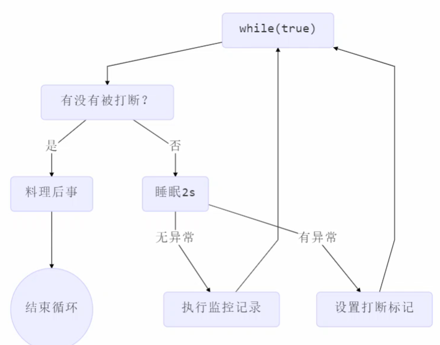

[TOC]

# Concurrent programming

- Two phase termination

- 

- ```java
  public class Main {
      public static void main(String[] args) throws ExecutionException, InterruptedException {
          TwoPhaseTermination twoPhaseTermination = new TwoPhaseTermination();
          twoPhaseTermination.start();
          Thread.sleep(3500);
          twoPhaseTermination.stop();
      }
  }
  @Slf4j
  class TwoPhaseTermination{
      private Thread monitor;
      public void start() {
          monitor = new Thread(() -> {
              while (true) {
                  Thread thread = Thread.currentThread();
                  if (thread.isInterrupted()) {
                      log.info("线程即将终止！");
                      break;
                  } else {
                      try {
                          TimeUnit.SECONDS.sleep(1);
                          log.info("执行监控记录!");
                      } catch (InterruptedException e) {
                          thread.interrupt();
                      }
                  }
              }
          });
          monitor.start();
      }
      public void stop() {
          monitor.interrupt();
      }
  }
  ```

- LockSupport.part() 阻塞线程直至打断标记为真，可以使用interrupted重置打断标记

- join等待线程执行

- 保护性暂停，使用while(condition) wait() ，来暂停线程等待唤醒

- 生产者消费者

- ReentrantLock java级别的Monitor

# java memory model

- 原子性、可见性、有序性

# Lock-free concurrent（乐观锁）

- CAS 建议在多核CPU且线程数少于CPU数

# Thread pool

- io密集型


