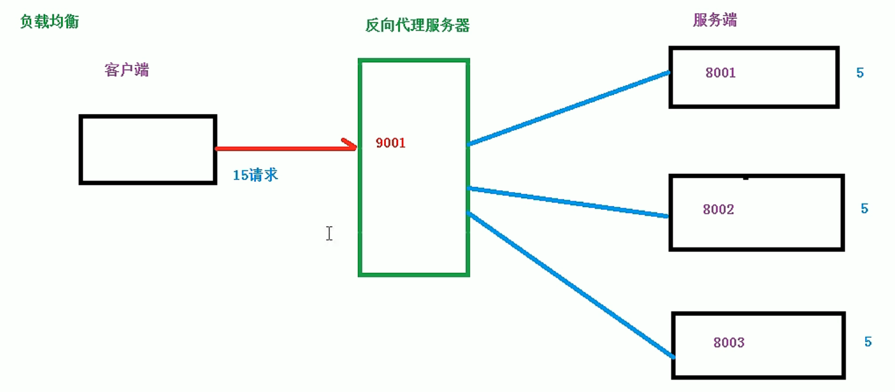
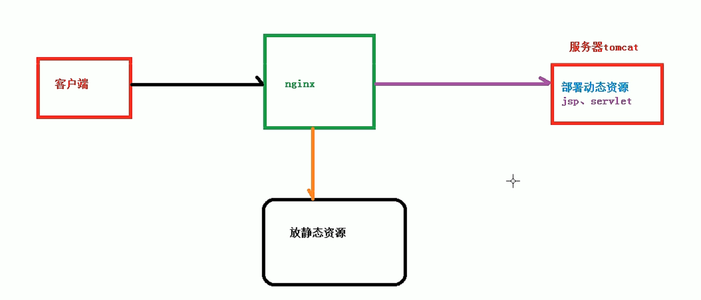

[TOC]

------

## Nginx简介

1. 高性能HTTP和反向代理Web服务器

2. 占用内存少，并发能力强，专为性能优化

3. 处理静态文件，和负载均衡

4. 支持热部署，启动容易，几乎做到不间断运行不需重启

5. 反向代理

   1. 可以用做正向代理 在客户端配置代理服务器，通过代理服务器访问互联网

      

   2. 反向代理 客户端对代理无感知

      

6. 负载均衡

   

7. 动静分离 为了加快网站解析速度，吧动态页面和静态页面由不同服务器来解析

   

## Nginx安装和使用

1. nginx 操作的常用命令
   1. 若是源码安装必须要进入nginx的目录中
   2. nginx -v 查看版本号
   3. nginx -s stop
   4. 查看启动 ps -ef | grep nginx
   5. 重启 nginx -s reload
2. nginx.conf 配置文件
   1. 全局块
      1. 从配置文件开始到events块之间的内容
      2. 主要会设置一些影响Nginx服务器整体运行的配置之灵，主要包括配置运行Nginx服务器的用户（组）、允许生成的worker process数，进程PID存放路径、日志存放路径和类型一级配置文件的引入等
      3. 例如
         1. worker_processes 1; 该值越大处理并发数量越多（会受硬件制约）
   2. events块
      1. 配置Nginx服务器与用户的网络连接数
      2. worker_connections 最大连接数
   3. http块 配置最频繁部分
      1. http全局块
      2. server块
         1. 和虚拟主机有密切联系
         2. 全局server块
         3. 局部server块

